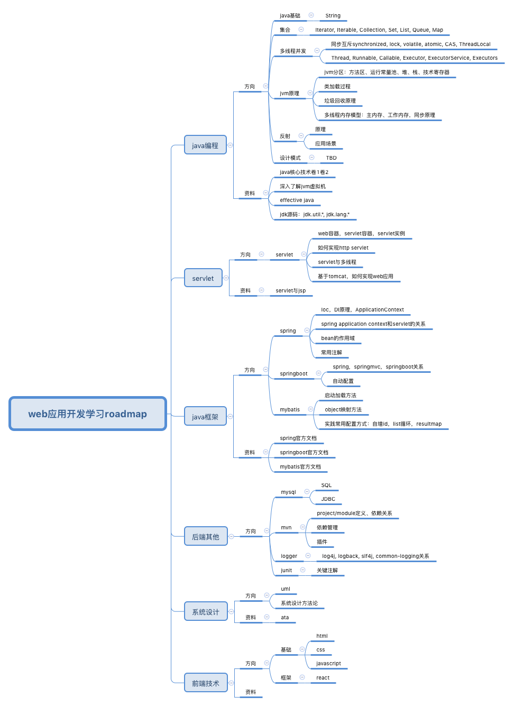

# Roadmap

## Servlet

[Servlet](Servlet.md)

## Spring

[Spring](Spring.md)

[SpringMVC](Spring.md)

[Springboot](Springboot.md)

## 前端

[HTML/CSS](HTML_and_CSS.md)

[Javascript](Javascript.md)

[React](React.md)

[杂](front.md)

[es6](ES6.md)

## 其他

[Mybatis](Mybatis.md)

[Maven](Maven.md)

[JUnit](JUnit.md)

[Logger](Logger.md)
